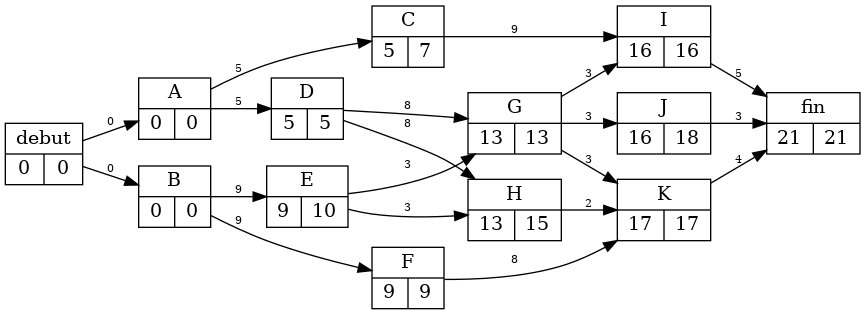

# Projet de création de schéma MPM

## Objectifs 

- Créer un docker permettant de lancer une page web qui permet d'a partir d'un tableau a remplir, de generer un png d'un schéma MPM.

## Qu'est ce qu'une MPM 

### Présentation de la MPM	

La MPM ou Méthode des Potentiels et antécédents Métra est une technique d'ordonnancement basée sur la théorie des graphes, visant à optimiser la planification des tâches d'un projet.	

### Méthodologie de construction d'un réseau MPM	

Le recours à la méthode des potentiels Métra suppose qu'aient été identifiées préalablement les différentes tâches nécessaires à la réalisation du projet, leur durée et leurs relations d'antériorité.

| Tâches | Durée | Antériorité |
|--------------|:-----:|-----------:|
| A	| 2	| -	|
| B	| 4	| - |
| C	| 4	| A	|
| D	| 5	| A,B	|
| E | 6	| C,D |	

### Conventions de base d'un graphe MPM	

La méthode des potentiels Métra permet de représenter l'ensemble de ces tâches sur un graphe orienté, à partir duquel il sera possible d'identifier leurs dates au plus et au plus tard et de calculer leurs marges.	
	Un graphe orienté est un réseau composé d'une entrée et d'une sortie, ainsi que de points (appelés "sommets") reliés entre eux par des flèches (appelées "arcs").	

Les principales conventions d'un réseau MPM sont les suivantes :	
- chaque tâche est représentée par un sommet	
- les contraintes de succession sont symbolisées par les arcs	
- chaque tâche est renseignée sur sa durée ainsi que sur la date à laquelle elle peut commencer au plus tôt ("date au plus tôt") et au plus tard ("date au plus tard") pour respecter le délai optimal de réalisation du projet.	
- le graphe commence et termine sur 2 sommets, respectivement appelés "Début" et "Fin" symbolisant les début et fin des opérations (mais ne correspondant pas une tâche).	

### Construction d'un graphe MPM	

Sur la base des conventions précédentes, la construction d'un graphe MPM ne pose pas de difficulté particulière, mais doit être réalisée avec méthode. La démarche la plus appropriée consiste à procéder par "niveau" :	
- déterminer les tâches sans antécédent (tâches de niveau 1) et les relier au sommet "Début"	
- identifier ensuite les tâches de niveau 2, c'est-à-dire celles dont les antécédents sont exclusivement du niveau 1 et les positionner sur le graphique en les reliant à leurs antécédents,	
- … continuer ainsi, jusqu'à ce que toutes les tâches aient pu être positionnées entre elles et relier celles n'ayant pas de descendant au sommet "Fin".	

### Lecture d'un graphe MPM	
Le graphe se lit de gauche à droite (du sommet "DÉBUT" à celui de "FIN").	
	Chaque sommet symbolise une tâche.	
	Les arcs entre les sommets traduisent uniquement les relations d'antériorité des tâches. D'un même sommet peuvent donc partir plusieurs flèches, lorsque la tâche correspondante est immédiatement antérieure à plusieurs tâches indépendantes.	

###  Détermination des dates "au plus tôt" et "au plus tard" dans un réseau MPM

Chaque sommet est identifié par une cartouche où sont précisés : le "nom de la tâche", la "durée de cette tâche", les dates de "début au plus tôt" et de "début au plus tard" de cette tâche.	

La date au plus tôt d'un réseau MPM correspond à la date à laquelle une tâche peut commencer au plus tôt.	
Elle s'obtient très simplement en ajoutant à la date au plus tôt de la tâche précédente la durée de la tâche en question :	
Date au plus tôt tâche T = Date au plus tôt tâche S + Durée tâche S	

Lorsque plusieurs arcs arrivent à un même sommet (c'est-à-dire que plusieurs tâches sont immédiatement antérieures à la tâche considérée), il convient, d'effectuer ce calcul pour toutes les tâches précédant la tâche en question et de retenir comme "date au plus tôt" de cette dernière le maximum des valeurs ainsi trouvée (en effet, cette tâche ne pourra vraiment débuter que lorsque toutes les tâches qui lui sont immédiatement antérieures auront été terminées). La formule précédente devient donc :	
- Date au plus tôt tâche T = Max. (Date plus tôt tâches S + Durée tâches S)	
- Dans cette formule, "S" représente l'ensemble des tâches immédiatement antérieures à "T"	

La détermination des dates au plus tôt des différentes sommets se fait donc par calculs successifs, à partir du sommet "Début" (dont, par convention, la date au plus tôt est fixée à 0).	
La durée minimale du projet correspond donc à la date au plus tôt du sommet "Fin".	

La date au plus tard d'un réseau MPM correspond à la date à laquelle une tâche doit être exécutée au plus tard pour ne pas remettre en cause la durée optimale totale du projet.	
Elle s'obtient en retirant de la date au plus tard de la tâche qui lui succède sa propre durée :	
- Date au plus tard tâche S = Date au plus tard tâche T - durée tâche S	

Lorsque plusieurs arcs partent d'un même sommet (i.e. que plusieurs tâches succèdent à une tâche donnée), il convient de faire ce calcul pour toutes les tâches succédant à la tâche en question et de retenir comme "date au plus tard" de de cette dernière le minimum des valeurs ainsi trouvées :	
- Date au plus tard tâche S = Min. (date au plus tard tâches T - durée tâche S)	
- Dans cette formule, "T" représente l'ensemble des tâches immédiatement postérieures à "S"	

La détermination des dates au plus tard des différentes tâches se fait donc à rebours du graphe, par calculs successifs, en partant du sommet "Fin" (pour lequel, par convention, on considère que la date au plus tard est égale à sa date au plus tôt).

### Calcul des différentes marges d'une tâche dans un réseau MPM

On appelle "marge" d'une tâche le retard qu'il est possible de tolérer dans la réalisation de celle-ci, sans que la durée optimale prévue du projet global en soit affectée.	
Il est possible de calculer trois types de marges : la marge totale, la marge certaine et la marge libre.	

La marge totale d'une tâche indique le retard maximal que l'on peut admettre dans sa réalisation (sous réserve qu'elle ait commencé à sa date au plus tôt) sans allonger la durée optimale du projet.	
Elle se calcule très facilement en faisant la différence entre la date au plus tard et la date au plus tôt de la tâche en question.	
Marge totale tâche S = Date plus tard tâche S - Date plus tôt tâche S	

Ainsi, dans notre exemple précédent (projet Y) :	
- Marge totale de A = (2 - 0) = 2	
- Marge totale de C = (5 - 2) = 3	

Sauf cas particulier, un retard correspondant à la marge totale d'une tâche se traduit par une modification des dates au plus tôt des tâches qui lui succèdent et entraîne, généralement, l'apparition d'un 2° chemin critique. Il n'est donc pas possible de cumuler des retards correspondant à leur marge totale sur plusieurs tâches successives, sans remettre en cause la durée optimale prévue pour le projet.	

La marge libre d'une tâche indique le retard que l'on peut admettre dans sa réalisation (sous réserve qu'elle ait commencé à sa date au plus tôt) sans modifier les date au plus tôt des tâches suivantes et sans allonger la durée optimale du projet.	
Elle se calcule en retirant la durée de la tâche en question à l'écart existant entre sa date au plus tôt de la date au plus tôt de la tâche suivante :	
- Marge libre tâche S = Date plus tôt tâche T - Date plus tôt tâche S - Durée tâche S	

Lorsque plusieurs arcs partent d'un même sommet (c'est-à-dire lorsque la réalisation de la tâche conditionne le début de plusieurs autres tâches indépendantes) il convient de faire ce calcul pour toutes les tâches succédant à la tâche en question et de retenir comme "marge libre" de la tâche en question la valeur minimale des marges ainsi déterminées :	
- Marge totale tâche S = Min (Date plus tôt tâches T - Date plus tôt tâche S - Durée tâche S)	
- Dans cette formule T représente l'ensemble des tâches succédant immédiatement à S	

Ainsi, dans notre exemple précédent (projet Y) :	
- Marge libre de A = Minimun [(2 - 0 - 2) , (4 - 0 - 2)] = Min [0, 2] = 0	
- Marge libre de C = (9 - 2 - 4) = 3	
Un retard correspondant à la marge libre d'une tâche reste sans conséquence sur les marges des tâches qui lui succèdent. Il est donc possible de cumuler des retards, s'inscrivant dans leur marge libre, pour plusieurs tâches successives, sans remettre en cause la durée optimale prévue pour le projet.	

La marge certaine d'une tâche indique le retard que l'on peut admettre dans sa réalisation (quelle que soit sa date de début) sans allonger la durée optimale du projet.	
Elle se calcule en retirant la durée de la tâche en question à l'écart qu'il peut y avoir entre sa date au plus tard de début et sa date au plus tôt de fin :	
- Marge certaine tâche S = Max [ 0 , Min (Date au plus tôt tâche T - Date au plus tard tâche S - Durée tâche S) ]	
D'après cette formule, la marge certaine est considérée comme nulle lorsque son calcul donne un nombre négatif	

Lorsque plusieurs arcs partent d'un même sommet (c'est-à-dire lorsque la réalisation de la tâche conditionne le début de plusieurs autres tâches indépendantes) il convient de faire ce calcul pour toutes les tâches succédant à la tâche en question et de retenir comme "marge certaine" de cette dernière la valeur minimale des marges ainsi déterminées :	
- Marge certaine tâche S = Max [0, Min (Date au plus tôt tâches T - Date au plus tard tâche S - Durée tâche S)	
- Dans cette formule T représente l'ensemble des tâches succédant immédiatement à S	

Ainsi, dans notre exemple précédent (projet Y) :	
- Marge certaine de A = Max [0, Min ( [2 - 2 - 2], [4 - 2 - 2] ) ] = Max [0, Min (-2, 0)] = 0	
- Marge certaine de C = Max [0, (9 - 5 - 4)] = 0	

Un retard correspondant à la marge certaine d'une tâche reste sans conséquence sur les marges des tâches qui lui succèdent, même si elle a commencé à sa date au plus tard.	
Il est donc possible de cumuler des retards, s'inscrivant dans leur marge certaine, pour plusieurs tâches successives, même si elles commencent à leur date au plus tard, sans remettre en cause la durée optimale prévue pour le projet.	

On remarque que les marges des tâches composant le chemin critique sont nécessairement nulles, puisqu'il s'agit de tâches pour lesquels, par définition, aucun retard n'est possible sans remettre en cause la durée optimale prévue pour le projet.	

## Réalisation

Lors de la création de l'image, est installé apache, java, php et graphviz. Les fichiers présent dans le dossier html sont transferé dans le repertoire ``/var/www/html``. Le docker se connecte sur le port 80 et execute le service apache en arriere plan au demarrage du conteneur.

Le fichier ``index.html`` sera afficher lorsque vous vous rendez sur votre ip local au port choisi. Grâce au fichier ``script.js`` vous pourrez ajouté des lignes au tableux présent dans le fichier html et récuperer les entrées pour les convertir en fichier csv avec ``enregistrer.php`` et executer le fichier ``MPM.java`` qui va permettre de trouver dates "au plus tôt" et "au plus tard". Le fichier java va ensuite créer un fichier ``.dot`` qui va etre executer en language bash par le php pour crée un png. Le fichier javascript va ensuite attendre 5 secondes le temps que l'image se genere puis la faire télécharger par l'utilisateur.

## Utilisation

Maintenant que vous savez ce qu'est un MPM, vous pouvez facilement généré votre schéma. Il existe cependant des conditions pour ne pas que le programme plante. Pour la colonne `Duree`, vous ne pouvez entrer des entiers non signé. Pour la colonne `Antériorité`, il faudra séparer par des virgules chaque antécédant. Il sera aussi possible de ne rien mettre pour signifié une abscence d'antécédant. Attention a ne peut pas mettre un sommet qui n'existe, a mettre un sommet antécédant de lui même ou mettre des sommets antécédants entre eux.

Vous pouvez ajouter des lignes et donc des sommets en appuyant sur le bouton correspondant, et quand vous avez finis votre tableau il suffit de cliquer sur le bouton Télécharger le schéma et attendre 5 secondes pour avoir votre schéma. Veillez a remplir chacune des lignes créer.

